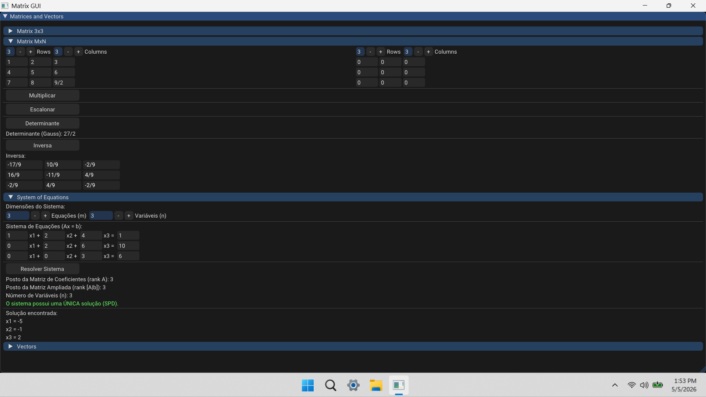

# Matrix GUI

A simple C++ application to perform matrix operations.

### Download

[MatrixGui.exe](https://github.com/weslleyskah/matrix_gui/releases)

### Run

> Run `scripts/build.bat` to generate the `build`

> Run `matrix_gui/build/Debug/MatrixGui.exe`

> Open the `matrix_gui/build/MatrixGui.slnx`, set `MakeGui.sln` as startup project, and run the code on Visual Studio

### Dependencies

- CMAKE
- [Vulkan](https://vulkan.lunarg.com/sdk/home#windows)
- [ImGui](https://github.com/ocornut/imgui)
- GLFW
- [Eigen](https://libeigen.gitlab.io/)

### Structure

| | |
| :--- | :--- |
| `src/` | application |
| `dependencies/` | dependencies |
| `scripts/` | build |
| `CMakeLists.txt` | build |
